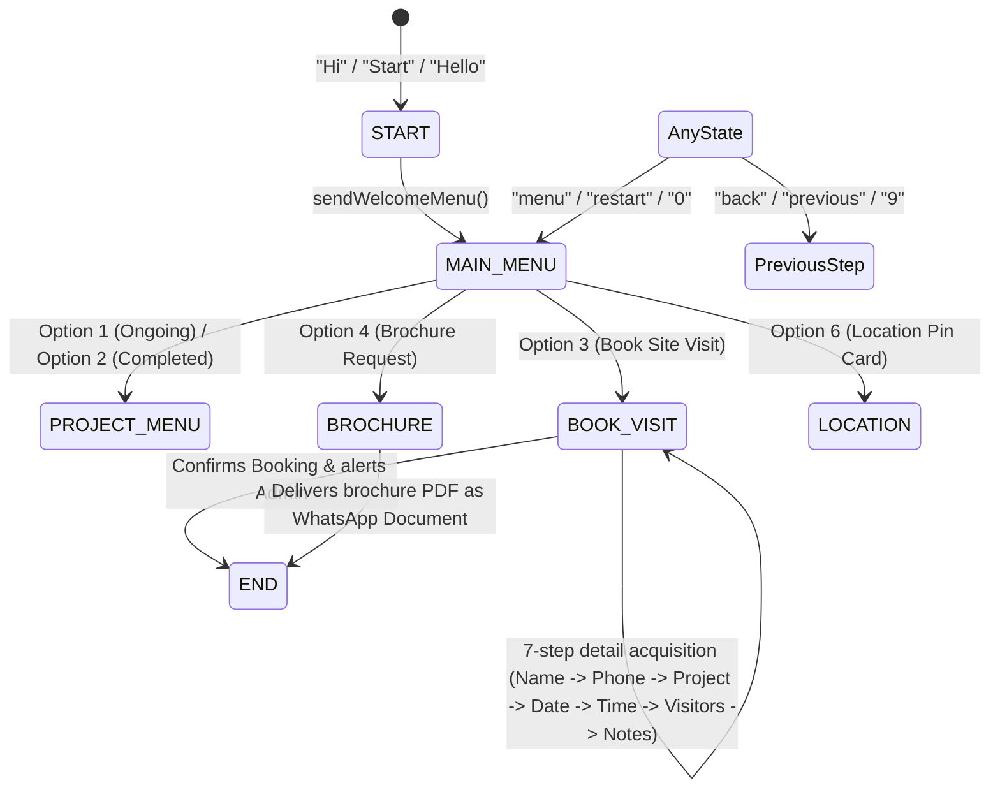

# Phase 1 Complete — Production Readiness & WhatsApp Cloud API Optimization

This document outlines the architecture, conversational flow, state machine, and configuration system implemented to make the Aditya Builders WhatsApp CRM backend fully production-ready.

---

## 1. Core Technical Accomplishments

### 1.1 Robust Webhook Request Parsing & Verification
- **Dynamic Port Mismatch / Proxy trust**: Mounted `app.set("trust proxy", 1)` in [server.js](file:///d:/CHARUSAT/Projects/AdityaBuilder/server/server.js) to resolve reverse proxy client headers behind Render.
- **Fail-safe Verification Routing**: Parsed parameters directly from `req.query`, falling back on manual URL query extraction from `req.originalUrl` to handle routing mismatches and variations from Meta's verification requests.
- **Fallback Webhook Bindings**: Mounted a fail-safe endpoint (`/webhook` alongside `/api/webhook`) in [whatsappRoutes.js](file:///d:/CHARUSAT/Projects/AdityaBuilder/server/src/routes/whatsappRoutes.js) to route webhook deliveries regardless of Meta developer app prefix configurations.

### 1.2 State Machine Driven Conversation Flow (MongoDB)
- The conversational chatbot flow transitions gracefully through the following states mapping:
  `START` ➔ `MAIN_MENU` ➔ `PROJECT_MENU` ➔ `BROCHURE` ➔ `LOCATION` ➔ `BOOK_VISIT` ➔ `END`.
- Built on top of the MongoDB `ConversationState` model to preserve conversational state data, user session parameters, and back-navigation history.

### 1.3 Command Interceptors & Command Reset Navigation
- **Welcome Menu Triggers**: Matches `"Hi"`, `"Hello"`, `"Hey"`, `"Start"`, `"Namaste"`, `"Hi Aditya"`, `"Restart"`, or `"Reset"` (case-insensitive) to trigger and deliver the welcome menu.
- **Main Menu Resets**: Evaluates `"menu"`, `"home"`, `"start"`, `"restart"`, `"0"` immediately at the entry point of the parser, wiping conversation state and drawing the welcome list.
- **Back Navigation**: Checks for `"back"`, `"previous"`, `"9"` (case-insensitive), dynamically swapping state context to the captured historical step (`previousFlow` and `previousStep`) and prompting the user with the prior step instructions.

### 1.4 Interactive Message Parsing
- Meta interactive payloads (both `button_reply` and `list_reply`) are parsed safely to extract user selection titles and values.

---

## 2. Production Performance & Security Enhancements

### 2.1 API Optimization & 2-Second Return
- Optimized webhook responses by calling `res.status(200).json({ success: true })` immediately upon payload parsing to ensure execution completes within the 2-second limit required by Meta. Heavy database writes and notifications are handled asynchronously.

### 2.2 Rate Limiting & Spam Protection
- Bypassed global Express rate limiters for webhook routes (`/api/webhook` and `/webhook`) to guarantee uninterrupted delivery of Meta callbacks.
- Implemented a sliding window spam controller limiting each customer to a maximum of 10 incoming messages per minute, returning a warning response if exceeded.

### 2.3 Duplicate Webhook Protection
- Added duplicate webhook logging checks using unique message IDs to bypass and immediately ignore duplicate Meta webhook retries.

### 2.4 Session Timeout
- Programmatically check `updatedAt` for the customer's state. If a conversation is inactive for more than 30 minutes, it is reset to stateless (clean welcome menu state) on the next incoming message.

### 2.5 Formatting & Styling
- Unified conversational bot messages with clean emojis, professional headings, and bold text formats.

### 2.6 Colored Console Diagnostics (ANSI)
- Log entry points in `receiveWebhook` format output with ANSI color tags depicting:
  - Senders and phone numbers (`\x1b[35m`)
  - Webhook delivery types (`\x1b[32m` for message, `\x1b[33m` for status)
  - Bot reply dispatches (`\x1b[32m` for text, interactive, location, or documents)

---

## 3. Webhook Flow State Transitions



---

## 4. Verification & Diagnostics

To run integration checks locally, execute the built-in diagnostic flow script:
```bash
node scripts/testSpecificFlow.js
```
This tests:
1. Webhook parsing capability.
2. MongoDB connectivity.
3. Automatic Customer creation and CRM mapping.
4. Auto-reply flow states.
