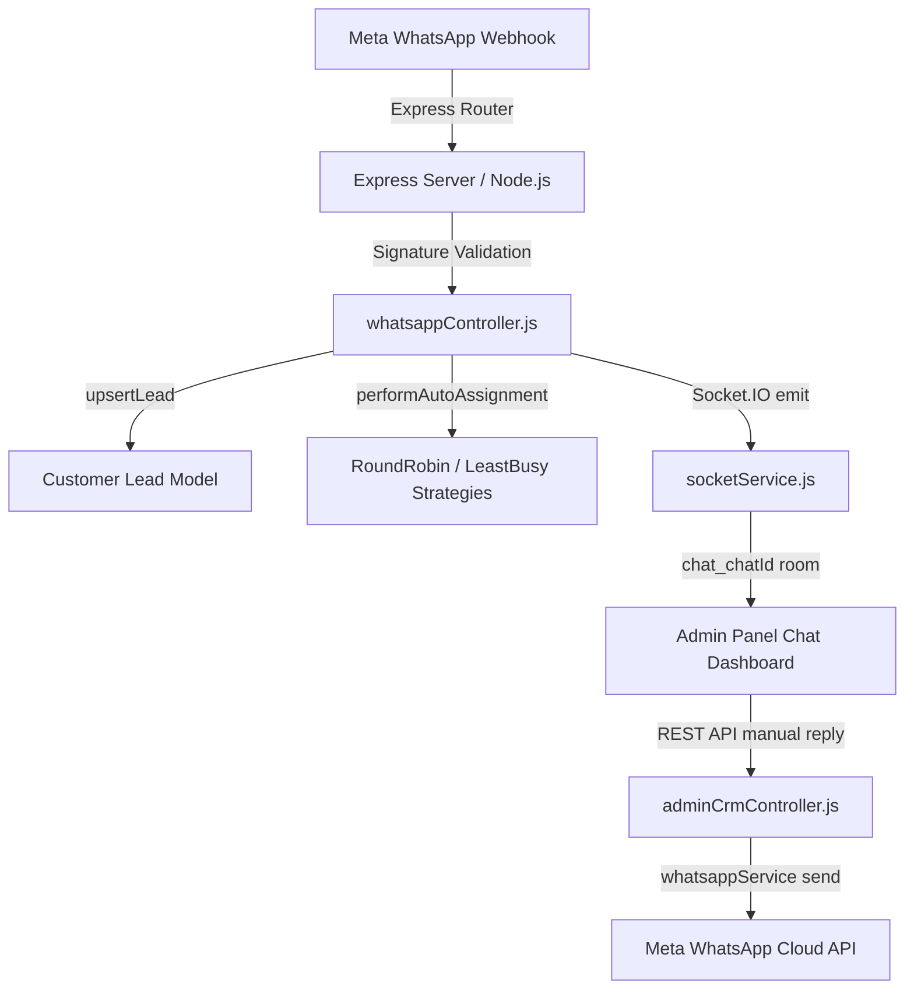

# Phase 3 Integration Documentation: WhatsApp CRM + Lead CRM + Analytics

This document provides a detailed overview of the Phase 3 architecture, MongoDB schema extensions, Socket.IO room-based event flows, granular permission matrix, lead auto-assignment systems, REST APIs, and testing procedures.

---

## 1. System Architecture

The CRM is designed using a decoupled MVC architecture integrated into the existing MERN stack:



---

## 2. MongoDB Models & Schema Updates

All models reuse the existing collections without duplicates:

1. **`Customer` (Lead CRM)** [REUSED & EXTENDED]
   - `leadStatus`: Updated enum: `["New", "Interested", "Follow Up", "Booked Visit", "Negotiation", "Won", "Lost", "Hot", "Warm", "Cold", "Booked"]`.
   - `priority`: `Low`, `Medium`, `High`, `Urgent`.
   - `budget`: Marketing/enquiry price range (String, e.g. `"₹60-80 Lakh"`).
   - `city` & `state`: Geographic locations of lead source.
   - `dealValue`: Total booking revenue (Number, optional, registered for Won deals).
   - `nextFollowUpDate`: Timeline follow-up reminder tracking.

2. **`Chat`** [REUSED & EXTENDED]
   - `status`: Updated enum: `["Open", "Assigned", "Waiting Customer", "Closed", "Spam", "Blocked", "Resolved"]`.

3. **`Message`** [REUSED & EXTENDED]
   - `deliveryStatus`: Updated enum: `["sent", "delivered", "read", "seen", "failed"]`.
   - `isDeleted`: Soft-deletion flag (`Boolean`, default: `false`).

4. **`Admin`** [REUSED & EXTENDED]
   - `role`: Updated enum: `["superadmin", "editor", "executive", "manager", "support"]`.

5. **`SiteSettings`** [REUSED & EXTENDED]
   - `whatsappAutoAssignmentStrategy`: Switch supporting `"RoundRobin"` or `"LeastBusy"`.
   - `lastAssignedExecutiveIndex`: Cycling counter tracking the Round Robin cursor.

---

## 3. CRM Role-Based Permissions Matrix

Granular matrix validation checks are implemented across all CRM controller endpoints:

| Action | Super Admin | Sales Manager | Sales Executive | Support / Editor |
| :--- | :---: | :---: | :---: | :---: |
| **View Chats** | ✅ (All) | ✅ (All) | ⚠️ (Only Assigned) | ✅ (All) |
| **Send Reply** | ✅ | ✅ | ⚠️ (Only Assigned) | ✅ |
| **Notes / Tags**| ✅ | ✅ | ⚠️ (Only Assigned) | ✅ |
| **Assign Leads**| ✅ | ✅ | ❌ | ❌ |
| **Status Change**| ✅ | ✅ | ⚠️ (Only Assigned) | ✅ |
| **Chat Deletion**| ✅ | ❌ | ❌ | ❌ |
| **Data Export** | ✅ | ✅ | ❌ | ❌ |
| **Analytics View**| ✅ | ✅ | ❌ | ❌ |

---

## 4. Live Chat Socket.IO Flow

To optimize network performance, broadcasts are targeted to specific Socket rooms:
* **Room `chat_chatId`**: Real-time incoming/outgoing messages, soft deletions, status updates, and composing typing indicators.
* **Room `admins`**: Global notifications for new leads, brochure downloads, callbacks, and appointments.
* **Admin Presence (`online_admins_list`)**: Monitors online connected admins.

---

## 5. Lead Auto-Assignment Configuration

Auto-assignment runs when a customer sends an incoming message and doesn't have an executive:
* **Round Robin**: Fetches active executives, assigns the customer, and increments the pointer index in settings.
* **Least Busy**: Compares the count of unclosed leads assigned to active executives and routes to the one with the lowest load.

---

## 6. REST API Endpoints

All endpoints require JWT token validation (`protect` middleware):

* **Conversation Routes**:
  - `GET /admin/crm/conversations` (Supports advanced search, pagination, status and type filters).
  - `GET /admin/crm/conversations/:id/messages` (Retrieves non-soft-deleted chat transcripts).
  - `POST /admin/crm/conversations/:id/reply` (Sends manual messages; auto-sets status to `Waiting Customer`).
  - `PATCH /admin/crm/conversations/:id/status` (Updates conversation workflow state).
  - `DELETE /admin/crm/conversations/:id` (Deletes chat thread history).
  - `DELETE /admin/crm/conversations/:id/messages/:messageId` (Soft-deletes message).
  - `GET /admin/crm/conversations/:id/export?format=json|csv|html` (Exports history).
* **Customer Profile Routes**:
  - `PATCH /admin/crm/customers/:id` (Edits name, email, lead status, executive, budget, city, state, deal value, follow up).
  - `POST /admin/crm/customers/:id/notes` (Appends internal CRM note).
  - `PUT /admin/crm/customers/:id/tags` (Updates tags list).
* **Analytics**:
  - `GET /admin/crm/analytics` (Generates KPIs, top projects, top executives, lead conversion rates, and revenue sums).

---

## 7. Testing & Verification

Execute the test command from the server directory:
```bash
node scripts/testPhase3Crm.js
```
This runs validation checks for:
- Round Robin cycle increments.
- Least Busy min-load assignments.
- Soft-deletion message count checks.
- Aggregate revenue calculations from won deal values.
