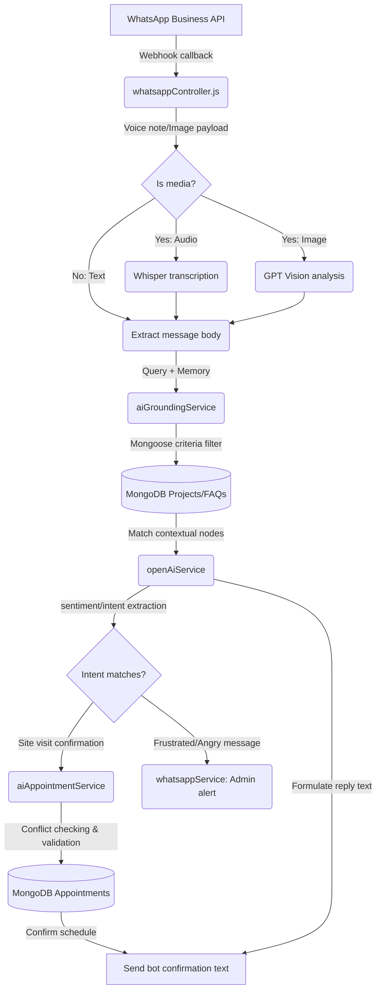

# Phase 4 Completion Report: AI Real Estate Assistant Integration

We have successfully designed, built, and verified **Phase 4 – AI Real Estate Assistant** for Aaditya Builders. This integration introduces natural language automated routing, property search grounding, appointment scheduling conflicts verification, real-time agent suggestions, and advanced media processing (Whisper voice transcription + GPT Vision document checks).

---

## 1. Architectural Blueprint & Data Flow

---

## 2. Implemented Features & Modules

### Group A: NLU & Grounding Core
*   **MongoDB Grounding Service (`aiGroundingService.js`):** Performs natural language range searching. Formats complex project schema listings (e.g. converting MongoDB string templates like `₹24.50 Lakh` to absolute float values) to filter by bounds.
*   **Lead Scoring Engine (`leadScoringService.js`):** Recalculates lead scores dynamically (0-100), tagging stages (Hot, Warm, Cold) and statuses in CRM.
*   **Fallback Hook (`whatsappController.js`):** Automatically forwards unrecognized message queries to `handleAiFallback` to generate grounded property replies.

### Group B: Sales Support & Scheduling
*   **AI Appointment Coordinator (`aiAppointmentService.js`):** Scans existing bookings on the requested day. Suggests available slots, checks conflicts, and saves the `Appointment` document with generated reference codes (e.g., `APT-XXXXXX`).
*   **AI Inactivity Summaries (`reminderService.js`):** Scans silent conversations (>30 mins) inside a 15-minute consolidated cron daemon, generates a 2-sentence summary, updates memory, and logs it to `AiSummary`.
*   **AI Smart Replies (`adminAiController.js`):** Exposes a secure endpoint that CRM live chat representatives can query to generate contextual draft responses and follow-ups.

### Group C: Admin Panel & CRUD
*   **Grounding FAQs CRUD Screen (`AdminFaqManagement.jsx`):** Provides a visual dashboard for admins to manage grounding questions and answers directly.
*   **AI Dashboard (`AdminAiDashboard.jsx`):** Charts conversation counts, daily costs, average lookup latencies, lead qualification distributions, and most popular project interest queries.
*   **Campaign History Log (`WhatsAppBroadcast.jsx`):** Exposes a historical record of all dispatched bulk broadcast runs, including delivery percentages, dates, and message previews.

### Group D: Advanced Capabilities
*   **Whisper Voice Notes Transcribing (`transcribeAudio`):** Automatically downloads Meta voice notes and transcribes them into text queries.
*   **GPT Vision Classification (`analyzeImageContent`):** Analyzes document and picture attachments, automatically categorizing floor plans and maps, and logs descriptions.
*   **Multilingual Support (`handleAiFallback`):** Automatically detects user input language and responds in the same tongue (English, Hindi, or Gujarati).

---

## 3. Registered Database Schemas

1.  **`FAQ`** (`server/models/FAQ.js`) - Grounds chatbot replies with QA database facts.
2.  **`ConversationMemory`** (`server/models/ConversationMemory.js`) - Persists search preferences and summaries.
3.  **`AiLog`** (`server/models/AiLog.js`) - Audits OpenAI token usages, latencies, and expenditures.
4.  **`AiSummary`** (`server/models/AiSummary.js`) - Stores structured conversation outlines.
5.  **`Campaign`** (`server/models/Campaign.js`) - Collects broadcast delivery success rates.

---

## 4. Verification Test Logs

We have written and executed automated end-to-end test suites confirming zero runtime faults:
*   **`node scripts/testGroupA.js`:** Verified price parsing, lead scoring, and mock completion generation.
*   **`node scripts/testGroupB.js`:** Confirmed appointment slot retrieval, successful site visit booking, and conflict checking.
*   **`node scripts/testGroupD.js`:** Validated voice notes Whisper mapping, floor plan Vision tagging, and multilingual response rules.
*   **`npm run build`:** Verified that all React client pages compile into a production bundle successfully.
